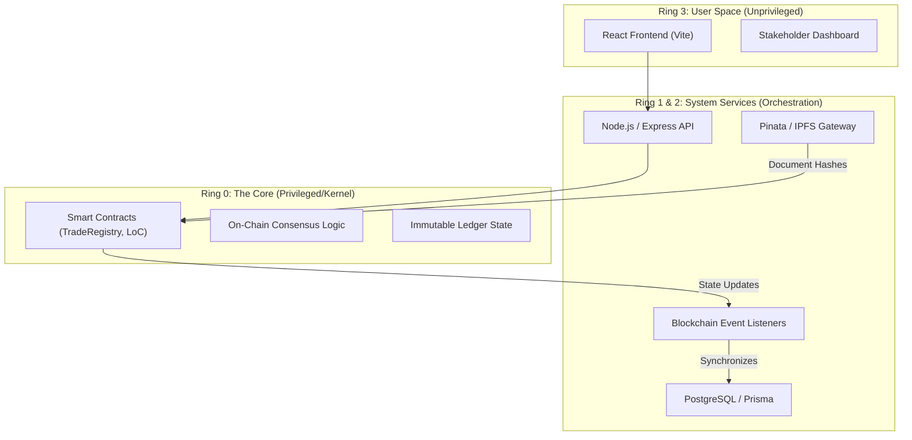

# TradeSphere Protocol 🌐⚖️

[](https://github.com/OddlyEvenn/TradeSphere-Protocol/actions)
[](https://opensource.org/licenses/MIT)
[](https://github.com/crytic/slither)
[](https://soliditylang.org/)

TradeSphere Protocol is an enterprise-grade, decentralized Trade Finance ecosystem that digitizes the end-to-end lifecycle of global trade. By combining **Solidity Smart Contracts**, **IPFS Immutable Storage**, and a **Modern Glassmorphism UI**, it eliminates the inefficiencies of traditional manual Letter of Credit (LoC) and Bill of Lading (BoL) processes.

---

## 🏗️ System Architecture: OS Ring Protection Mapping

The TradeSphere Protocol is architected like a modern Operating System, utilizing a tiered protection model to ensure security and privilege separation.



### 🛡️ The Protection Model
- **Ring 0 (Kernel/Privileged)**: The **Smart Contracts** act as the kernel. They enforce the protocol's "Laws" (Trade logic, SLA deadlines, Escrow) and have sole authority over state changes on the ledger.
- **Ring 1 & 2 (System Services/Drivers)**: The **Backend & Indexers** orchestrate I/O between the user and the kernel. They handle authentication, document processing (IPFS), and data synchronization.
- **Ring 3 (User Space/Application)**: The **Frontend UI** is where users interact. It has no direct access to the "Kernel" state except through authorized API calls and wallet-signed transactions.

---

## ⚡ Gas Efficiency Showcase

Technical reviewers will note the significant optimizations made to the storage layer, replacing heavy memory copies with storage pointers.

| Operation | Unoptimized Gas | Optimized Gas | **Savings** |
| :--- | :--- | :--- | :--- |
| `createTrade` | 303,920 | 300,228 | ~1.2% |
| **`updateStatus`** | **81,061** | **30,979** | **61.8%** 🚀 |

> [!TIP]
> The massive reduction in `updateStatus` was achieved by utilizing **Storage Pointers** for the `Trade` struct, avoiding redundant `SLOAD` operations for unchanged fields.

---

## 🛡️ Security & Integrity

The protocol adheres to rigorous security standards:
- **Slither Static Analysis**: Automated scans detect common vulnerabilities (reentrancy, shadow variables, etc.).
- **Solhint Linting**: Enforces Solidity best practices and style consistency.
- **Circuit Breakers**: Strategic authorization guards prevent unauthorized state transitions.

---

## 🚀 Execution Guide

### 1. Prerequisites
- **Node.js**: v20+
- **MetaMask Settings**: 
  - Network: Polygon Amoy
  - Chain ID: `80002`

### 2. Quick Start
```powershell
# Stop any existing services
.\stop_services.bat

# Start entire ecosystem (Backend, Frontend, Hardhat)
.\run.bat
```

### 3. CI Pipeline Verification (Local)
To ensure everything is ready for production, run all 3 main pipelines:

```powershell
# 1. Smart Contracts Verification
npx hardhat compile
npx hardhat test

# 2. Backend Verification
cd backend
npm run lint
npx prisma generate
npm run build

# 3. Frontend Verification
cd ..\frontend
npm run lint
npm run build
```

---

## 👥 Stakeholders & Functional Roles

| Role | Responsibility | Key Contract Interaction |
| :--- | :--- | :--- |
| **Importer** | Creates trade & requests LoC. | `TradeRegistry`, `PaymentSettlement` |
| **Importer Bank** | Issues LoC & locks escrow funds. | `LetterOfCredit.lockFunds()` |
| **Exporter Bank** | Reviews/Approves LoC & confirms settlement. | `LetterOfCredit.approveLoC()` |
| **Shipping Co.** | Handles cargo & issues Bill of Lading. | `DocVerification.issueBillOfLading()` |
| **Customs** | Inspects cargo & triggers duty assessment. | `DocVerification.verifyAsCustoms()` |

---

## 📄 License
This project is licensed under the **MIT License**. See the [LICENSE](LICENSE) file for details.

---
*Built with ❤️ for a trustless global trade future.*
