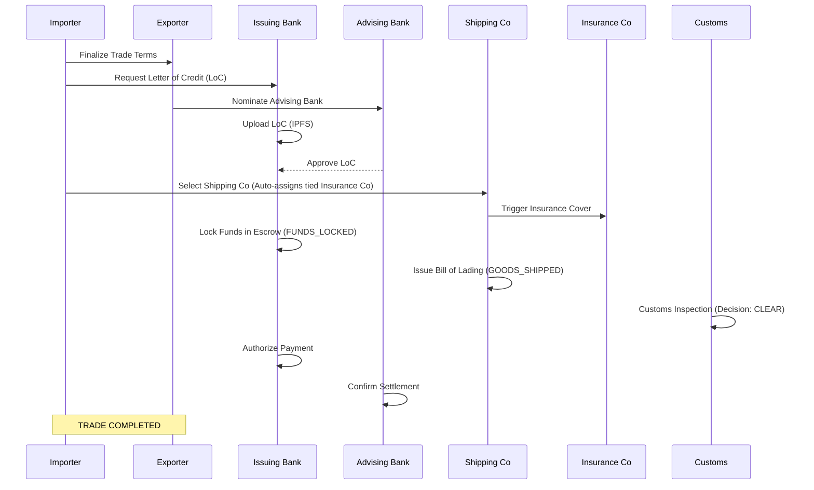

# TradeSphere Protocol: Complete Lifecycle & Scenario Flow

This document provides a comprehensive overview of the end-to-end trade finance process within the TradeSphere ecosystem, covering standard flows, customs options, and decentralized consensus voting.

---

## 1. Core Actors (Stakeholder Nodes)

| Actor | Role | Responsibilities |
| :--- | :--- | :--- |
| **Importer** | Buyer | Initiates trade, requests LoC, pays duties. |
| **Exporter** | Seller | Supplies goods, nominates advising bank, receives payment. |
| **Issuing Bank** | Importer's Bank | Issues LoC, locks funds in escrow, authorizes final payment. |
| **Advising Bank** | Exporter's Bank | Reviews/Approve LoC, confirms final settlement. |
| **Shipping Co.** | Logistics | Collects goods, issues Bill of Lading (BoL) on-chain. |
| **Customs** | Govt. Authority | Verifies legal compliance, calculates duties, clears cargo. |
| **Inspector** | Auditor | Physical inspection of cargo (quality/quantity). |
| **Insurance** | Underwriter | Automatically assigned via tie-up with Shipping Co. Underwrites risk and evaluates claims. |

---

## 2. Standard Operational Flow (Happy Path)

---

## 3. Customs Decision Scenarios (3 Options)

When goods arrive, the **Customs Node** must make one of three critical decisions in the `DocumentVerification` contract:

### A. Option 1: Direct Clearance (Decision 0)
*   **Result:** Trade status moves directly to `CUSTOMS_CLEARED`.
*   **Action:** No duties required. Payment flow can proceed immediately.

### B. Option 2: Flag for Duty (Decision 1)
*   **Result:** Trade status moves to `DUTY_PENDING`.
*   **Sequential Steps:**
    1.  Tax Authority assesses duty amount (off-chain).
    2.  Importer Bank confirms duty payment on-chain (`confirmDutyPayment`).
    3.  Tax Authority records the tax receipt (`recordTaxReceipt`).
    4.  Tax Authority releases goods (`releaseFromDuty`).
    5.  **Final State:** `CUSTOMS_CLEARED`.

### C. Option 3: Entry Rejection (Decision 2)
*   **Result:** Trade status moves to `ENTRY_REJECTED`.
*   **Context:** Used for illegal cargo, document fraud, or severe health/safety violations.
*   **Next Step:** Typically triggers a **Consensus Dispute** to determine if the trade should be reverted or fine-tuned.

---

## 4. Decentralized Voting & Consensus (Dispute Scenarios)

When a dispute is raised, the system enters a **7-Node Consensus** phase. This ensures that every primary stakeholder has a voice in the final decision to revert a multi-million-dollar trade.

### The 7 Voting Nodes (Threshold: 4/7 Votes)
Each node carries **1 weight**, meaning a simple majority of 4 votes is required to execute a final decision (`REVERT` or `PAYOUT`).

| Node | Weight | Justification |
| :--- | :---: | :--- |
| **Inspector** | 1 | Physical verification of cargo quality and quantity at the port. |
| **Customs** | 1 | Verification of legal compliance, taxes, and manifest accuracy. |
| **Insurance** | 1 | Evaluation of claim validity based on evidence and surveyor reports. |
| **Issuing Bank** | 1 | Protection of the Importer's capital and compliance with LoC terms. |
| **Advising Bank** | 1 | Protection of the Exporter's payment and settlement integrity. |
| **Importer** | 1 | Direct buyer stake; ensures the goods meet their requirements. |
| **Exporter** | 1 | Direct seller stake; ensures they are not unfairly penalized. |

---

### Final Decision & Action Scenarios

If the vote reaches the **Threshold of 4**, the system executes the final decision.

| Scenario | Dispute Reason | Evidence Required | Final Decision (Yes/No) | Action Taken |
| :--- | :--- | :--- | :--- | :--- |
| **Cargo Damage** | Water/physical damage detected. | IPFS Photo & Inspector Report. | **YES (4+ REVERT)** | **Transaction Revert:** Escrow funds returned to Importer. |
| **Fake Documents** | BoL doesn't match LoC terms. | Scanned Document Hash Mismatch. | **YES (4+ REVERT)** | **Transaction Revert:** Escrow funds returned to Importer. |
| **SLA Breach** | Shipping deadline missed. | Time-stamp of on-chain BoL issue. | **YES (4+ REVERT)** | **Transaction Revert:** Escrow funds returned to Importer. |
| **Invalid Claim** | Dispute raised without proof. | Lack of IPFS data / Counter-report. | **NO (<4)** | **No Revert:** Trade proceeds to standard settlement. |
| **Insurance Claim** | Goods lost at sea. | Manifest & Loss Certificate. | **YES (4+ PAYOUT)** | **Insurance Payout:** Exporter receives insurance funds; Importer refunded. |

---

## 6. Shipping & Insurance Tie-up Logic

To streamline the trade process, the **TradeSphere Protocol** enforces a strict tie-up between logistics and insurance providers.

### Automatic Assignment
1.  **Default Provider:** Every Shipping Company identifies a default Insurance Partner in their profile.
2.  **Selection Trigger:** When the Importer selects a Shipping Company for a trade, the system **automatically assigns** the tied Insurance Company to that specific trade ID.
3.  **Update Policy:**
    *   Shipping companies can update their default insurance partner at any time in their dashboard.
    *   **CRITICAL RULE:** A tie-up change **will not** apply to active trades. The insurance provider assigned at the moment of shipping selection remains locked until the trade is `COMPLETED` or `REVERTED`.

### Insurance Premium & Payment Flow
**Who pays for the insurance?** 
*   The **Exporter** typically pays the insurance premium (standard CIF - Cost, Insurance, and Freight terms).
*   **On-Chain Logging:** The premium amount is calculated off-chain but logged as a required fee in the `PaymentSettlement` contract.
*   **Settlement:** When the final payment is released to the Exporter, the insurance premium is automatically deducted and transferred to the Insurance Company's wallet, ensuring the payment is always "insured" before the Exporter receives their funds.

---

## 8. Physical Goods Assignment & Inspection

In the **TradeSphere Protocol**, the "Physical Assignment" of goods occurs through a verification handshake:

1.  **Selection (Exporter):** The Exporter identifies and prepares the specific goods based on the contract (SLA) terms.
2.  **Assignment (Inspector):** The **Inspector Node** (e.g., SGS) is the authority that "assigns" the quality and quantity certificates on-chain. They physically inspect the goods at the port or warehouse and upload a report (IPFS hash). Once this report is uploaded, the goods are considered "assigned" to the trade.
3.  **On-Chain Verification:** The Inspector's report is the primary evidence used during any Consensus Dispute (Revert/Payout).

---

## 9. Freight (Shipping) Payment & Incoterms

In real-world trade, the responsibility for paying the shipping company (Freight) is determined by **Incoterms**.

### Scenario A: CIF (Cost, Insurance, and Freight) - *Most Common in Trade Finance*
*   **Who Pays:** The **Exporter** is responsible for paying the shipping and insurance fees.
*   **The Flow:** The Exporter pays the shipping company off-chain (or it's deducted on-chain). The cost is already included in the total trade value.
*   **Responsibility:** The Exporter handles the logistics until the goods reach the destination port.

### Scenario B: FOB (Free On Board)
*   **Who Pays:** The **Importer** is responsible for all shipping costs from the moment the goods are loaded onto the vessel at the port of origin.
*   **The Flow:** The Importer pays the shipping company directly.
*   **Responsibility:** The Exporter's responsibility ends as soon as the goods cross the "ship's rail."

### The TradeSphere Implementation
In our protocol, while the **Importer** simplifies the process by selecting the shipping carrier (to ensure they trust the transit), the **payment** remains a **CIF-style model**. The shipping fee is logged on-chain and **deducted from the final escrow payout** to the Exporter, ensuring the shipping provider is automatically paid when the trade is `COMPLETED`.

---

## 11. Shipping Company Selection Logic (Importer vs Exporter)

A common question in trade finance is: **Who has the authority to select the carrier?**

### Option A: Exporter-Led Selection (Traditional CIF model)
*   **In Real Life:** Under **CIF (Cost, Insurance, and Freight)** terms, the **Exporter** selects the shipping company. Since they are paying for the freight and insurance and are responsible for the goods until they reach the destination port, they choose the partner they trust to deliver.
*   **In the Project:** This simplifies the Importer's experience but gives them less control over the carrier's reputation.

### Option B: Importer-Led Selection (FOB-style control)
*   **In Real Life:** Under **FOB (Free On Board)** terms, the **Importer** selects the shipping company. They take full responsibility for the goods once they are loaded onto the ship at the port of origin, so they want to control the logistics from that point forward.
*   **In the Project:** This allows the Importer to select a carrier they trust (e.g., Maersk, MSC) to ensure their multi-million-dollar cargo isn't handled by an unverified or low-quality provider.

### Project Recommendation: Importer-Led Selection
For the **TradeSphere Protocol**, we recommend **Importer-Led Selection** because:
1.  **Buyer Protection:** It gives the party whose money is locked in escrow (the Importer) the final say on the logistics partner who will handle their goods.
2.  **Tracking Trust:** The Importer can ensure the carrier is on the consortium's list of verified nodes.
3.  **Financial Alignment:** Even with Importer-led selection, the cost is still deducted from the Exporter's final payout (maintaining the CIF-style payment convenience).

---

## 12. Technical Recovery: The "Transaction Revert"

A "Transaction Revert" in the TradeSphere protocol is a **State Revert & Escrow Refund** mechanism. It does not erase blockchain history but moves the contract into a recovery state.

1.  **Status Change:** The `TradeStatus` moves to `TRADE_REVERTED_BY_CONSENSUS`.
2.  **Autonomous Refund:** The Smart Contract vault (escrow) triggers a transfer of the locked funds back to the **Issuing Bank** on behalf of the Importer.
3.  **Audit Integrity:** The complete trail—original agreements, shipping documents, dispute proof, and the 7-node individual votes—remains permanently visible for regulatory audit.
